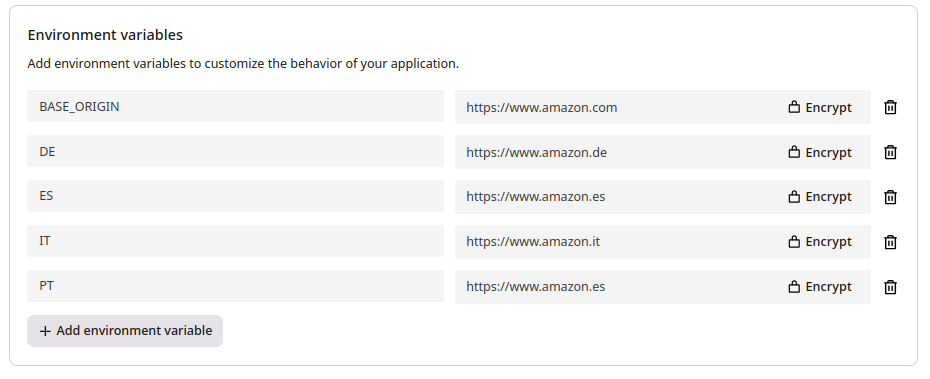

[← Back to examples](../README.md)

# Geo Redirect

This application does a simple redirect based on the clients location.

It takes a `BASE_ORIGIN` url, which is where landing clients will be redirected to by default.

However for each additional environment_variable that is a valid country-code, it will redirect to
its value.

e.g.

